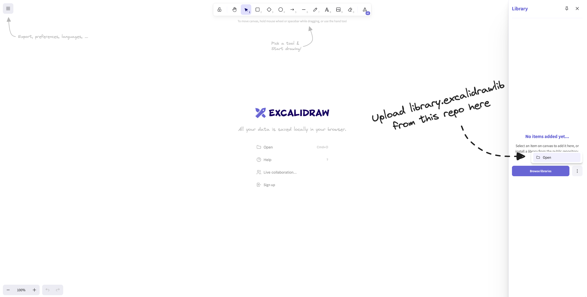
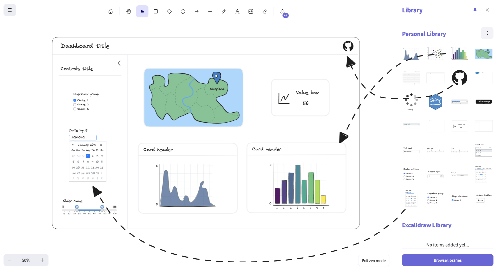

# shinydraw

## Overview
shinydraw is an Excalidraw library that lets you quickly prototype shiny apps with a near-zero learning curve.

## Access
A [pull request](https://github.com/excalidraw/excalidraw-libraries/pull/1375) 
has been submitted to have the library feature in the official Excalidraw repository. In the interim you can manually add shinydraw to your Excalidraw library by:
1. Downloading the file `library.excalidrawlib` from this repository
2. In Excalidraw, clicking "Library" -> Three vertical dots -> "Open"

## How To
Just drag and drop the components you want to build a prototype:

