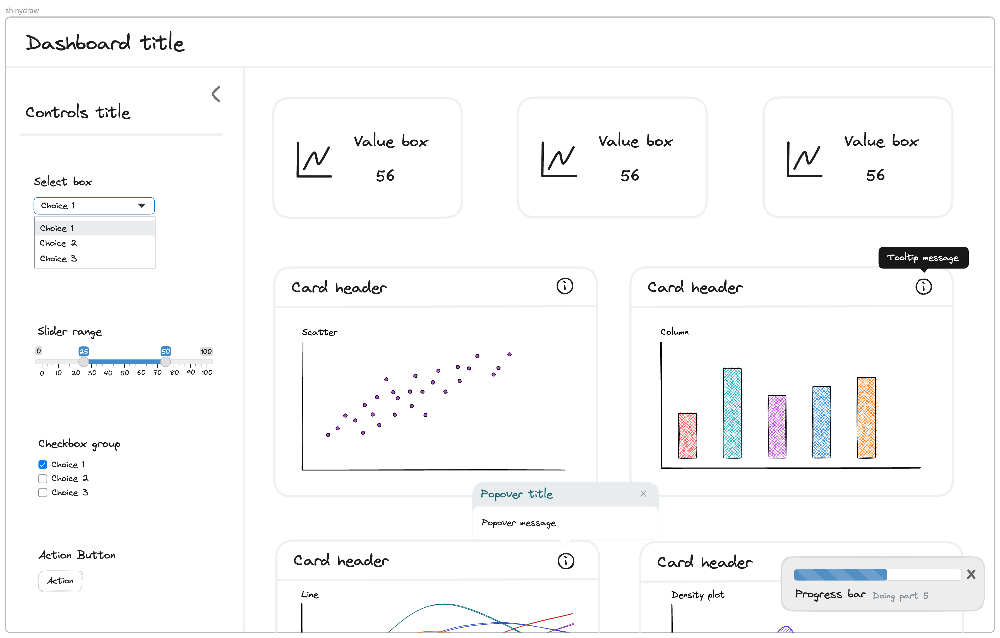

# shinydraw
This repository contains the assets to create the Shiny library in Excalidraw.

A [pull request](https://github.com/excalidraw/excalidraw-libraries/pull/1375) 
has been submitted to have the library feature in the official Excalidraw repository.

